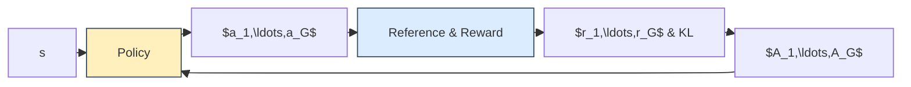

# 強化学習から PPO / GRPO まで

この資料は，強化学習の基本から，Policy Gradient，PPO，GRPO へつなげるためである．最初は一般的な強化学習として説明し，後半で RenjuTransformer にどう対応するかを説明する．

## 記法

この文書では，対応する確率変数と実現値がある場合，原則として確率変数を大文字，その実現値を対応する小文字で表す．例えば，状態を表す確率変数を $S_t$，実際に観測された状態を $s_t$ と書く．ただし，価値関数 $V_\pi$，行動価値関数 $Q_\pi$，Advantage $A_\pi$，return $G_t$ などについては，強化学習で一般的な表記を優先する．同じ文字の場合は，添字，引数，アクセントで意味を区別する．

| 記号                                    | 意味                                     |
| ------------------------------------- | -------------------------------------- |
| $t$                                   | エピソード内の時刻                              |
| $T$                                   | エピソードの終端時刻                             |
| $k$                                   | 将来の時刻または項を数える添字                        |
| $S_t$                                 | 時刻 $t$ の状態を表す確率変数                      |
| $s$                                   | 任意の状態                                  |
| $s'$                                  | 状態 $s$ から遷移した次の状態                      |
| $A_t$                                 | 時刻 $t$ の行動を表す確率変数                      |
| $a$                                   | 任意の行動                                  |
| $R_{t+1}$                             | 時刻 $t$ の行動後に得られる報酬を表す確率変数              |
| $r(s,a,s')$                           | 状態 $s$ で行動 $a$ を取り，状態 $s'$ に遷移したときの報酬  |
| $G_t$                                 | 時刻 $t$ から終端までの割引リターン                   |
| $\tau$                                | 方策と環境によって生成された1本の軌跡                    |
| $\gamma$                              | 将来の報酬に対する割引率                           |
| $\lambda$                             | GAE におけるバイアスと分散の調整係数                   |
| $\epsilon$                            | PPO および GRPO における確率比のクリップ幅             |
| $\beta$                               | KL正則化の係数                               |
| $\delta_t$                            | 時刻 $t$ の Temporal Difference 誤差        |
| $\pi(a\mid s)$                        | 状態 $s$ で行動 $a$ を選ぶ確率を与える方策             |
| $\pi_\theta(a\mid s)$                 | パラメータ $\theta$ を持つ学習対象の方策              |
| $\pi_{\theta_{\rm old}}(a\mid s)$     | データを生成した更新前の方策                         |
| $\pi_{\mathrm{ref}}(a\mid s)$         | KL正則化の基準となる固定方策                        |
| $p(s'\mid s,a)$                       | 状態 $s$ で行動 $a$ を取ったときに状態 $s'$ への遷移確率   |
| $V_\pi(s)$                            | 方策 $\pi$ における状態 $s$ の状態価値関数            |
| $Q_\pi(s,a)$                          | 方策 $\pi$ における状態 $s$，行動 $a$ の行動価値関数     |
| $A_\pi(s,a)$                          | 方策 $\pi$ における状態 $s$，行動 $a$ の advantage |
| $\hat{A}_i$                           | GRPO の候補 $i$ に対する相対 advantage          |
| $\hat{A}_\pi^{\mathrm{MC}}(s_t,a_t)$  | モンテカルロ法による advantage の推定値              |
| $\hat{A}_\pi^{\mathrm{GAE}}(s_t,a_t)$ | GAE による advantage の推定値                 |
| $b(S_t)$                              | 方策勾配の分散を低減する baseline関数                |
| $J_\pi(\theta)$                       | 方策 $\pi_\theta$ の期待リターンを表す目的関数         |
| $L_\pi(\theta)$                       | 方策勾配法で用いる方策損失                          |
| $\rho_\theta(s,a)$                    | TRPO および PPO における新旧方策の確率比              |
| $r_i(\theta)$                         | GRPO の候補 $i$ に対する新旧方策の確率比              |
| $D_{\mathrm{KL}}(p\mathbin{\|}q)$     | 確率分布 $p$ と $q$ の KLダイバージェンス            |

## 1. 強化学習の問題設定

強化学習では，エージェントが環境に対して行動し，その結果として次の状態と報酬を受け取る．エージェントの目的は，将来得られる報酬の合計が大きくなるような行動の選び方を学習することである．基本的な流れは次のようになる．
```math
\begin{gathered}
状態 S_t を観測する \\
 \downarrow \\
方策 \pi に従って行動 A_t を選ぶ \\
 \downarrow \\
環境が次の状態 S_{t+1} と報酬 R\left(S_t, A_t\right)を返す \\
 \downarrow \\
これを終端 まで繰り返す \\
\end{gathered}
```
このように，次の状態や報酬が現在の状態と行動のみで決定される時系列のことを，マルコフ決定過程（Markov Decision Process, MDP）と呼ぶ．
```math
\begin{align}
S_t&: 現在の状態 \\
A_t&: 現在の行動 \\
R_{t+1}&: 行動後に得られる報酬 \\
S_{t+1}&: 次の状態 \\
\pi(A_t=a | S_t=s)&: 状態 s で行動 a を選ぶ方策 \\
\end{align}
```
このようにして，軌跡(trajectory)が
```math
\tau = \left( S_0​,A_0​,R_1​,S_{1​},A_{1}​, R_2​​,\ldots,S_t​,A_t, R_{t+1}​​,\ldots,R_{T},S_{T}​\right)
```
生成される．この書き方がプログラムに馴染む定義であり，こちらを採用する．
エージェントは現在の状態 $s$ を観測し，方策 $\pi(a \mid s)$によって，行動 $a$ を選択する．そして，MDPを仮定すると，状態遷移確率 $p(s' \mid s, a)$ によって次の状態 $s'$ へと遷移し，報酬関数 $r\left(s,a,s'\right)$ により報酬が得られる．

## 2. Return と割引率

終端時刻 $T$ までの軌跡 $\tau$ に対して，ある時刻 $t$ から将来得られる報酬の合計をリターンまたは収益と呼び，
```math
G_{t}​​ = \gamma^0 R_{t+1} + \gamma R_{t+2} + \gamma^2 R_{t+3} + \dots + \gamma^{T-t-1} R_{T}
```
と書く．和の記号で書くと
```math
\begin{align}
G_{t} & = \sum_{k=0}^{T-t-1} \gamma^k R_{t+k+1} \\
\end{align}
```
であり，初期状態 $(t=0)$ から将来得られる報酬の合計
```math
\begin{align}
G_{0} & = \sum_{k=0}^{T-1} \gamma^k R_{k+1}
\end{align}
```
となり，再帰的には
```math
G_{t} = R_{t+1} + \gamma\ G_{t+1}
```
とかける．ここで $\gamma$ は割引率である．
- $\gamma = 1.0$: 将来の報酬を弱めない
- $\gamma = 0.99$: 遠い将来の報酬を少し弱く見る
- $\gamma = 0$: 次の報酬だけを見る
割引率を使う理由は，遠い未来の報酬ほど不確実であり，現在の行動との因果関係も弱くなりやすいからである．

## 3. 価値関数 と advantage 

強化学習では，「ある状態がどれくらい良いか」を表す関数を価値関数と呼ぶ．
状態価値関数 $V_\pi(s)$は，状態 $s$ から方策 $\pi$ に従って行動した時のリターンの期待値である．
```math
\begin{align}
V_\pi(s) & := \mathbb{E}_\pi\left[G_t\mid S_t=s\right]　\\
&= \mathbb{E}_\pi\left[\sum_{k=0}^{T-t-1} \gamma^k R_{t+k+1} \mid S_t=s \right]
\end{align}
```
一方で，行動価値関数 $Q_\pi(s, a)$ は，状態 $s$ で特定の行動 $a$ を取った時のリターンの期待値である．
```math
\begin{align}
Q_\pi(s, a) & := \mathbb{E}_\pi\left[G_t \mid S_t=s, A_t=a \right] \\
& = \mathbb{E}_\pi\left[\sum_{k=0}^{T-t-1} \gamma^k R_{t+k+1} \mid S_t=s, A_t=a \right] \\
& = \mathbb{E}[R_{t+1} \mid S_t=s,A_t=a]+\gamma\ \mathbb{E}_\pi[G_{t+1} \mid S_t=s, A_t=a] \\
\end{align}
```
ここで， $Q_{\pi(s, a)}$ の行動 $a$ は，方策 $\pi$ には関係ないことに注意する．
$Q_\pi(s, a)$ の行動 $a$ は自由に決定することができ，その行動の後は，方策 $\pi$ に従って行動する．
また，最終行では，報酬 $R_{t+1}$ の期待値は方策 $\pi$ と無関係となるため除いた．

この二つの価値関数の違いは
- 状態価値関数 $V_\pi(s)$: この状態 $s$ はどれくらい良いか
- 行動価値関数 $Q_\pi(s, a)$: この状態 $s$ でこの行動 $a$ はどれくらい良いか
であり，
状態価値関数 $V_\pi(s)$では，行動 $a$ は方策 $\pi$ に従って選ばれ，
行動価値関数 $Q_\pi(s,a)$ では，行動は自由に選ぶことができる点が相違点となる．
このため，行動価値関数 $Q_\pi(s, a)$ の行動を方策 $\pi$ に従って選ぶとしたら，
行動価値関数 $Q_\pi(s, a)$ と状態価値関数 $V_\pi(s)$ は同じになる．そのため，状態価値関数 $V_\pi$ は，その状態で取り得る行動価値関数 $Q_\pi(s,a)$ を方策で平均したものという次の式が成り立つ．
```math
V_\pi(s) = \sum_a \pi(a \mid s) Q_\pi(s, a)
```
この二つの価値関数より，advantage関数 $A_\pi(s,a)$ を
```math
A_{\pi}\left(s, a\right) = Q_\pi(s, a) - V_\pi(s)
```
と定義する．この式は，特定の行動 $a$ を選んだ場合の価値から方策 $\pi$が選ぶ行動の平均的な良さを引いた値を示す．そのため，advantage関数は，特定の行動 $a$ が平均的な行動よりどれくらい良かったかを表す量となる．
$A_{\pi} > 0$ なら，その行動は平均より良い．
$A_{\pi} < 0$ なら，その行動は平均より悪いということになる．advantage を使うことで，「絶対的に報酬が高いか」ではなく，「その状態の中で相対的に良い行動か」を見やすくなる．単純に return $G_t$ だけを使うと，報酬のばらつきが大きくなりやすい．

## 4. ベルマン方程式

状態価値関数は以下のように，「即時報酬」と「次の状態の価値」に分解でき，ベルマン方程式で書ける．
```math
\begin{align}
V_\pi(s)
& = \sum_a \pi(a \mid s) Q_\pi(s, a)\\
& = \sum_a \pi(a \mid s)\ \mathbb{E}_\pi[R_{t+1} + \gamma\ G_{t+1} \mid S_t=s, A_t=a] \\
& = \sum_a \pi(a \mid s)\ \mathbb{E}[R_{t+1}\mid S_t=s, A_t=a]  + \gamma \sum_a \pi(a \mid s)\ \mathbb{E}_\pi [G_{t+1} \mid S_t=s, A_t=a] \\
& = \sum_a \pi(a \mid s)
\sum_{s'} p(s' \mid s, a)
\left(r(s, a, s') + \gamma V_\pi(s')\right)
\end{align}
```
この導出は，前の2式を組み合わせることで可能で，
状態価値関数におけるベルマン方程式は「状態 $s$ の価値関数」と「その次に取りうる $s'$ の価値関数」との関係を示し，
```math
\begin{align}
状態 s の価値 = & その状態で各行動を選ぶ確率 \times \\
&   その行動で次の状態に移る確率 \times \\
&   「即時報酬 + 次の状態の価値」 \quad の合計
\end{align}
```

```math
V_\pi(s)
=
\overbrace{\sum_a
\underbrace{\pi(a|s)}_{\text{方策の確率}}
\underbrace{
\sum_{s'}
\underbrace{p(s'|s,a)}_{\text{次の状態の確率}}
\left(
\underbrace{r(s,a,s')}_{\text{即時報酬}}
+
\overbrace{\gamma}^{\text{割引率}}
\underbrace{V_\pi(s')}_{\text{次の状態の価値}}
\right)
}_{\text{行動価値 } Q_\pi(s,a)}
}^{\text{状態価値} V_\pi(s)}
```
となる．行動価値関数 $Q(s,a)$におけるベルマン方程式も以下のように書ける．
```math
Q_\pi(s, a)
= \sum_{s'} p(s' \mid s, a)
\left(r(s, a, s') + \gamma V_\pi(s')\right)
```
これら二つのベルマン方程式から最適ベルマン方程式を導出し，最適行動または価値関数から，最適方策を求めるのが価値ベースの手法である

## 5. On-policy と Off-policy

強化学習では，「学習で更新する方策（target policy）」と「学習用データを集める時の行動方策（behavior policy）」という二つの方策が必要となる．強化学習は，方策を更新する際にどの方策から集めたデータを使うかで On-policy （方策オン）と Off-policy（方策オフ）の二つに分けられる．On-policy は，target policy と behavior policy が同じである訓練手法である．つまり，
以下の図のように，現在の方策で集めたデータを使って，方策を更新することであり，自分の経験から自分を更新する．On-policyの手法は，データ効率が悪くなりやすいが，方策の更新方向が現在の方策に対応しているため，目的関数の意味は比較的明確である．
```math
\begin{align}
現在の方策&で行動をサンプル \\
& \downarrow \\
報酬&を得る \\
& \downarrow \\
そのデータで&同じ方策を更新 \\
\end{align}
```

一方で，Off-policy は，target policy と behavior policy が異なる訓練手法である．つまり，現在の方策とは違う方策で集めたデータで訓練を行い，他人の経験から自分を更新する．
このため，過去の経験を保存し，訓練に再利用可能でデータ効率が良い．

## 6. 価値ベースと方策ベース

強化学習の方法は大きく分けると，価値ベースと方策ベースに分けられる．
### 価値ベース
価値ベースでは，「行動そのもの」ではなく「その行動を取ったときの良さ・価値」，状態or行動価値関数を学習し，価値が最大になるように行動を選んでいく．
代表的なものとして，状態 $s$ で行動 $a$ を取ったときの価値関数 $Q(s, a)$ を学習する手法が挙げられる．
つまり，「この状態でこの行動を取ると，将来的にどれくらい報酬が得られそうか」を数値として学習していく．
そして，過去に経験した軌跡 $(s, a, r, s')$ を使用し，価値関数が更新する．
そのため，価値関数が更新されると，同じデータでも違う結果となり，同じデータでも再び学習使用可能となる．また，価値ベースは，最適行動を求めるために，全ての可能な行動を確認する必要があり
```math
a^* = \arg \underset{a}{\max} Q_\pi(s, a)
```
を計算する．このため，行動候補が離散的で，最善手がはっきりしている問題に強い．しかしながら，行動空間が非常に大きい場合や連続値の場合に扱いづらい．例えば行動空間が $-1 \le a \le 1$ だと，行動 $0.999$ の価値， $0.998 $ の価値を計算する必要があり，困難である．さらに，最適行動決定の際，価値最大化を行うために，価値の過大評価が起きやすく，価値の誤差が行動選択に直接影響してしまう．シンプルな設定では理論的な収束性を議論しやすいという利点もある．代表例は Q-Learning，DQN，SARSA である．

### 方策ベース
方策ベースでは，行動を選ぶ方策 $\pi_{\theta}$ ，「状態 $s$ で，どの行動 $a$ をどれくらいの確率で選ぶか」を学習している．これにより，最終的に欲しい方策を直接学習できる点， 確率的な方策や連続的な行動を自然に扱える点が優れている点となる．
一方で，現在の方策 $\pi_{\theta}$ で行動し，得られた報酬で更新を行うため，現在の方策で集めたデータが重要となり，On-policyになりやすく，データ効率が悪くなりやすい．例えば，報酬が大きかったり，小さかったりすると，勾配が振り幅が大きくなるため，学習が不安定となる．そして，
方策ベースの手法では，基本的に，将来報酬の期待値を最大化するため，どの行動が本当に良かったのかという credit assignment が難しいという点もある．代表例は REINFORCE，actor-critic，PPO，GRPO である．

## 7. Policy Gradient

方策ベースの基本は，方策 $\pi_\theta(a \mid s)$ のパラメータ $\theta$ を直接更新することである．
目的は，方策 $\pi_\theta$ に従って生成された軌跡 $\tau$ のリターンの期待値の最大化 $\max J_\pi(\theta)$ 

```math
\begin{align}
J_\pi(\theta) & = \mathbb{E}_{\tau \sim \pi_\theta}[G_0] \\
& = \mathbb{E}_{\tau \sim \pi_\theta}\left[ \sum_{k=0}^{T} \gamma^k R_{k+1}
\right]
\end{align}
```
であり，方策勾配定理より，この目的関数における方策勾配は， 
```math
\nabla_\theta J_\pi(\theta)
= \mathbb{E}_{\tau \sim \pi_\theta}
\left[
\nabla_\theta \log \pi_\theta(a_t \mid s_t)\ G_0
\right]
```
書くことができる．詳細な導出に関しては，他の文献を参照してください．ここで，
```math
\nabla_\theta \log \pi_\theta(a_t \mid s_t) = \dfrac{\nabla_\theta \pi_\theta(a_t \mid s_t)}{\pi_\theta(a_t \mid s_t)}
```
となる．
ここで $\nabla_\theta \pi_\theta(a_t \mid s_t)$ は，方策の確率 $\pi_\theta(a_t \mid s_t)$ を大きくする方向となる．そのため，方策勾配とは，「良かった行動の確率を上げ，悪かった行動の確率を下げる」方向となる．
収益 $G_0$ が正なら $\log\pi_\theta(a_t \mid s_t)$ を大きくする方向に更新し，収益 $G_0$ が負なら小さくする方向に更新する．そのため，報酬の分散が大きいと，それが直接更新方向に影響を及ぼすため，学習が不安定になりやすい．そこで，報酬の分散を減らすようにしたのが，REINFORCEやbaseline導入やactor-critic という手法である．
REINFORCEでは，目的関数の一部である $G_0$ を $G_{t}$ に変更した手法である．
収益 $G_0$ は初期状態から将来 $(t=T)$ までの報酬の合計期待値となる．しかし，時刻 $t$ の現在状態において，初期状態から現在時刻までの報酬は，エージェントが取りうる行動の良し悪しとは関係ない．現在から将来までの報酬の合計期待値 $G_{t}$ を利用しても，方策勾配
```math
\nabla_\theta J(\theta)
= \mathbb{E}_{\tau \sim \pi_\theta}
\left[
\nabla_\theta \log \pi_\theta(a_t \mid s_t)\ G_0
\right]
= \mathbb{E}_{\tau \sim \pi_\theta}
\left[
\nabla_\theta \log \pi_\theta(a_t \mid s_t)\ G_t\right]
```
が等価となることを証明した．時刻$t$について，軌跡全体の報酬を
```math
G_0 = \sum_{k=0}^{T-1} \gamma^k R_{k+1}= \sum_{k=0}^{t-1} \gamma^k R_{k+1} + \sum_{k=t}^{T-1} \gamma^k R_{k+1}
```
と分解することより，
```math
\begin{align}
\nabla_\theta J(\theta)
& = \mathbb{E}_{\tau \sim \pi_\theta}
\left[
\nabla_\theta \log \pi_\theta(a_t \mid s_t)\ G_0
\right]\\
& = \mathbb{E}_{\tau \sim \pi_\theta}
\left[
\nabla_\theta \log \pi_\theta(a_t \mid s_t)\ \sum_{k=0}^{t-1} \gamma^k R_{k-1} 
\right] + \mathbb{E}_{\tau \sim \pi_\theta}
\left[
\nabla_\theta \log \pi_\theta(a_t \mid s_t)\ \sum_{k=t}^{T} \gamma^k R_{k-1} 
\right]\\
& = 0 + \mathbb{E}_{\tau \sim \pi_\theta}
\left[
\nabla_\theta \log \pi_\theta(a_t \mid s_t)\ G_t\right]
\end{align}
```
となる．ここで，第1項が0となるのは Expected Grad-Log-Prob (EGLP) lemma より[こちら](https://spinningup.openai.com/en/latest/spinningup/extra_pg_proof1.html)を参照．
$G_t$ は，現在からの報酬となるので，the **reward-to-go** from that pointと呼ばれる．
さらに，(EGLP) lemmaより，行動 $a$に依存しない関数であればどのような値を引いても方策勾配は変化しないことにより，以下のようにbaseline関数 $b(S_t)$ を導入したもの
```math
\nabla_\theta J(\theta)
= \mathbb{E}_{\tau \sim \pi_\theta}
\left[
\nabla_\theta \log \pi_\theta(a_t \mid s_t)\ 
\left( G_t- b\left(S_t\right) \right)
\right]
```
がある．ここで，baseline関数に状態価値関数 $V_\pi$ を用いると，方策勾配
```math
\begin{align}
\nabla_\theta J(\theta)
& = \mathbb{E}_{\tau \sim \pi_\theta}
\left[
\nabla_\theta \log \pi_\theta(a_t \mid s_t)\ 
\left( G_t- V_\pi\left(S_t\right) \right)
\right] \\
\end{align}
```
として，現在の状態に対する報酬を引いて，選択した行動の価値のみを方策勾配に反映できる．
他の方策勾配としては，行動価値関数 $Q_\pi$を用いた
```math
\nabla_\theta J(\theta)
= \mathbb{E}_{\tau \sim \pi_\theta}
\left[\nabla_\theta \log \pi_\theta(a_t \mid s_t)\ Q_\pi\left(s_t, a_t\right)\right]
```
ものや， advantage 関数を用いた
```math
\nabla_\theta J(\theta)
= \mathbb{E}_{\tau \sim \pi_\theta}
\left[
\nabla_\theta \log \pi_\theta(a_t \mid s_t)\ A_\pi\left(s_t, a_t\right)
\right]
```
ものがある．また，方策を勾配によって急激に変更させると，学習が崩壊するため，勾配を調整して，進ませることが重要である．一方で，少しずつしか更新できないため，局所最適解に陥りやすいという欠点もある．これをプログラムで実装する際には，方策損失（policy loss）として
```math
L_\pi(\theta) = - \mathbb{E}_{\tau \sim \pi_{\theta_{\rm old}}}
\left[ \log \pi_\theta(a_t \mid s_t)\ A_\pi\left(s_t, a_t\right)
\right]
```
とすることで，自動微分によって方策勾配を計算する仕組みとなっている．訓練上で注意すべきは，方策勾配法でのロス関数は，通常の教師あり学習のロスとはかなり意味が異なる．強化学習において本当に最大化したいものは 収益期待値 $J_\pi(\theta)$ である．訓練実装上，上記のようなadvantage関数を用いた方策勾配で更新する時は，方策損失を
```math
L_\pi(\theta) = - \mathbb{E}_{\tau \sim \pi_{\theta_{\rm old}}}
\left[ \log \pi_\theta(a_t \mid s_t)\ A_\pi\left(s_t, a_t\right)
\right]
```
と定義して，最小化する．この損失関数は通常の損失関数とは異なる．異なる点は，データ分布がパラメータに依存することと，この損失がモデル性能を計測していないことの2点である．
まず，強化学習において，方策 $\pi_\theta$が更新されると，エージェントの行動が変化し，訪れる状態も変わる．従って，収集されるデータそのものが変化する，データ分布がパラメータに依存しているということになる．現在の方策で集めたデータを使い，現在のパラメータで評価したときのみ，その勾配が方策損失を改善する方向を教えてくれるものであり，モデル性能を評価しているものではないということに注意するべき．そして，この方策損失はいくらでも小さくできるかもしれないが，その結果として実際の方策性能は崩壊することがある．
このように，方策勾配法はOn-policy で，学習が不安定になりやすいことから，安定した更新手法の研究が進んだ．他には，Natural policy gradientという方策の自然勾配を使用する手法や，Trust Region Policy Optimization (TRPO)がある．

## 8. Generalized Advantage Estimation (GAE)

実際に，方策損失
```math
L_\pi(\theta) = - \mathbb{E}_{\tau \sim \pi_{\theta_{\rm old}}}
\left[ \log \pi_\theta(a_t \mid s_t)\ A_\pi\left(s_t, a_t\right)
\right]
```
を最小化する際，advantage 関数 $A_\pi\left(s_t, a_t\right)=Q_\pi(s, a) - V_\pi(s)$ を推定することが求められる．
この時のadvantage 関数の推定手法について説明する．
まず，Temporal Difference 誤差 (TD residual) 
```math
\delta_t = r_{t+1} + \gamma V_\pi(s_{t+1}) - V_\pi(s_t) 
```
を用いた手法である．なぜなら，TD 誤差がadvantage 関数の不偏推定量
```math
\begin{align}
\mathbb{E}_{s_{t+1} \sim p\left(\cdot | s_t, a_t\right)} \left[r_{t+1} + \gamma V_\pi(s_{t+1}) - V_\pi(s_t)\right] & = \mathbb{E}_{s_{t+1} \sim p\left(\cdot | s_t, a_t\right)} \left[Q_\pi(s_t, a_t) - V_\pi(s_t)\right]= A_\pi(s_t, a_t) \\
\end{align}
```
である．TD誤差とは，環境モデルを使用せず，行動を１つ行う度に価値関数を更新する手法であるTD法が基である．
TD法では，現在の状態価値関数 $V_\pi(s_t)$ を，現在の報酬 $r_t$ と次の状態価値関数を用いて，サンプル近似を行う．そして，この近似をTD誤差で評価し，状態価値関数を更新することで，適当な状態価値関数を計算し，方策の評価を行う．このように，推定値を使って別の推定値を更新することを ブートストラップ と言う．
このTD法は，現在の状態価値関数を，1ステップ先の行動で評価するものであり，
価値関数における分散が低い，すぐ次の報酬しか見ないので安定しやすいという利点と，価値関数の推定が間違っているとバイアスが大きくなるという欠点が存在する．そこで，これは2，3ステップのように，伸ばすことでより良くすることが可能になると考えられる．
一方で，エピソード終了までの報酬を全部使い，収益を推定する手法もある．これはモンテカルロ (MC) 推定と呼ばれる．MC法では，
```math
\begin{align}
\hat{A}^{MC}_\pi(s_t, a_t) & = \sum_{k=0}^{T-t-1} \gamma^k r_{t+k+1} - V_\pi(s_t)\\
\end{align}
```
と推定を行い，実際に得られた将来報酬を使用し，長期的な結果をよく反映する．一方で，多くのランダムな報酬を合計するため分散が大きく，学習が不安定になりやすい．TD誤差は低分散だがバイアスが大きくなりやすく，MC推定は低バイアスだが高分散になりやすい．
この二つの間を取って，N-step advantage 推定という，Nステップまで実際の報酬を用い，Nステップ以降は，推定値を用いてブートストラップを行う手法もある．しかし，このようにバイアスと分散のトレードオフを調整する必要があり，Nステップを一つ決定する必要がある．
そこで提案されたのが， Generalized Advantage Estimation(GAE)で，
```math
\begin{align}
\hat{A}^{GAE}_\pi(s_t, a_t) & = \sum_{k=0}^{T-t-1} (\gamma\lambda)^k \delta_{t+k} \\
where\  \delta_t & = r_{t+1} + \gamma V_\pi(s_{t+1}) - V_\pi(s_t)\end{align}
```
のように，将来のTD誤差を遠いものほど小さい重みで，いろいろなNステップ advantage 推定を重み付き平均する．
ここで，重み係数 $\lambda$ を0から1まで変化させることで，バイアスと分散のトレードオフを調整可能．
重み係数 $\lambda$ が小さいと，TD法に近づき，低分散・高バイアスで
重み係数 $\lambda$ が大きいと，MC法に近づき，高分散・低バイアスとなる．

## 9. TRPO
TRPOでは，ある方策 $\tilde{\pi}$と他の方策 $\pi$との収益期待値の差の公式
```math
\mathbb{E}_{\tau \sim \tilde\pi_\theta}[G_0] = \mathbb{E}_{\tau \sim \pi_\theta}[G_0] + \mathbb{E}_{\tau \sim \tilde\pi_\theta}\left[ \sum_{k=0}^{T} \gamma^k A_\pi(s_t,a_t) \right]
```
を元に，代理目的関数 (surrogate objective function) $L_{\mathrm{TRPO}}(\theta)$ として，
```math
L_{\mathrm{TRPO}}(\theta) = \mathbb{E}_{\tau \sim \pi_{\theta_{\rm old}}}\left[\frac{\pi_{\theta}(a_t\mid s_t)}{\pi_{\theta_{\rm old}}(a_t\mid s_t)} A_{\pi_{\theta_{\rm old}}}(s_t,a_t)  \right]
```
を選ぶ．この代理目的関数の勾配は，初期状態では，元の収益期待値の勾配と等しく，1次精度近似となっている．具体的には，
```math
\begin{align}
\nabla_\theta L_{\mathrm{TRPO}}(\theta) & = \mathbb{E}_{\tau \sim \pi_{\theta_{\rm old}}}\left[  \frac{\nabla_\theta \pi_{\theta}(a_t\mid s_t)}{\pi_{\theta_{\rm old}}(a_t\mid s_t)} A_{\pi_{\theta_{\rm old}}}(s_t,a_t)  \right] \\
& = \mathbb{E}_{\tau \sim \pi_{\theta_{\rm old}}}\left[\frac{\pi_{\theta}(a_t\mid s_t)}{\pi_{\theta_{\rm old}}(a_t\mid s_t)} \nabla_\theta \log \pi_{\theta}(a\mid s) A_{\pi_{\theta_{\rm old}}}(s_t,a_t)  \right] \\
\end{align}
```
となる。ここで，probability ratio を
```math
\rho(\theta) = \frac{\pi_{\theta}(a\mid s)}{\pi_{\theta_{\rm old}}(a\mid s)}
```
とすると， $\rho(\theta_{\rm old})=1$ となる．従って，
```math
\begin{align}
\nabla_\theta L_{\mathrm{TRPO}}(\theta)\Big|_{\theta=\theta_{\rm old}}　
& = \mathbb{E}_{\tau \sim \pi_{\theta_{\rm old}}}\left[ \nabla_\theta \log \pi_{\theta}(a_t\mid s_t) A_{\pi_{\theta_{\rm old}}}(s_t,a_t)  \right]\Big|_{\theta=\theta_{\rm old}}　 \\
& = \nabla_\theta J(\theta)\Big|_{\theta=\theta_{\rm old}}　
\end{align}
```
となる．TRPO の代理目的関数は，古い方策のデータ上で「良かった行動の確率を上げ，悪かった行動の確率を下げる」ものである．実際の実装では，自動微分を考慮すると，方策損失は，
```math
L(\theta) = \mathbb{E}_{\tau \sim \pi_{\theta_{\rm old}}}\left[\frac{\pi_{\theta}(a_t\mid s_t)}{\pi_{\theta_{\rm old}}(a_t\mid s_t)} A_{\pi_{\theta_{\rm old}}}(s_t,a_t)  \right]
```
となり，ここで， $\pi_{\theta}(a_t\mid s_t)$ は，ある特定の状態 $s_t$ 時にある特定の行動 $a_t$ が出る確率となる．
そのため，古い方策での確率と，新しい方策での確率の比が係数となる．
これにより，同じバッチを使いながら，現在の方策が古い方策からどれくらいズレたかを ratio で追跡可能となり，この行動の確率を古い方策に比べてどれくらい変えたかを管理可能となる．
古い方策で集めたデータを使って何回か更新しても，古い方策から離れすぎないようにしている．そのため，データ効率が通常の方策勾配法よりも良くなる．通常の方策勾配法では，すぐに，バッチ内のデータのみに最適化されてしまう．環境から軌跡を集めるのが高コストである強化学習では，よりデータ効率の良い手法が求められる．
さらに，TRPOでは，訓練における学習率だけではなく，古い方策と新しい方策の距離を KLダイバージェンス $D_{KL}\left( \pi_{\theta_{\rm old}} \| \pi_{\theta}\right)$ が一定以下になるように制約をかけながら，更新することも提案されている．しかしながら，このKL制約付き最適化問題を解くには，ヘッセ行列が必要となるため，計算コストが高いという問題がある．以降のPPOで損失関数に入れることで解決されていく．

## 10. PPO

このように，方策ベースの強化学習において，勾配方策をそのまま使うと，1回の更新で方策が大きく変わりすぎることがある．
そして，方策が急に変わると，集めた On-policy データがすぐ古くなり，学習が不安定になると点がある．TRPOの良いアイデアを引き継ぎながら，1次精度の最適化手法で提案されたのが Proximal Policy Optimization (PPO)である．
TRPOのアイデアである，更新前の方策 $\pi_{\theta_{\rm old}}$ と，更新中の方策 $\pi_\theta$ の確率比
```math
\rho_t(\theta)
= \frac{\pi_\theta(a_t \mid s_t)}
{\pi_{\theta_{\rm old}}(a_t \mid s_t)}
```
を用いて，更新を制限する．さらに，クリップ幅 $\epsilon$ を用いて， $\rho_t$ をクリップすることで，より更新する幅を制限している．PPO の clipped objective function
```math
L_{\mathrm{PPO}}(\theta)
=
\mathbb{E}_t
\left[
\min
\left(
\rho_t(\theta) A_{\pi_{\theta_{\rm old}}}(s_t,a_t),\,
\mathrm{clip}(\rho_t(\theta), 1-\epsilon, 1+\epsilon) A_{\pi_{\theta_{\rm old}}}(s_t,a_t)
\right)
- \beta D_{\mathrm{KL}}\left(\pi_{\theta_{\rm old}}(\cdot \mid s_t)\ \|\ \pi_\theta (\cdot \mid s_t)\right)
\right]
```
と書ける．PPO の直感は次の通りである．
- advantage が正の行動は，確率を上げたい
- advantage が負の行動は，確率を下げたい
- ただし，一度に大きく変えすぎると壊れるので，確率比を clip する
- 良くなりすぎる方向は打ち切る  （クリップすると $\theta$ 依存がないので勾配0）
- 悪くなる方向はそのまま罰する　（クリップしても $r_t(\theta)$ が悪すぎなら反映）
また，TRPOからの改善として，KLダイバージェンスをロスに入れる手法もここで提案された．
PPOは基本的に，actor-critic で用いられ，この場合，状態価値関数 $V_\pi$ がcritic となる．
PPOにおけるadvantage の推定には，Generalized Advantage Estimation (GAE)が用いられる．

PPO schematic view
 ```mermaid
%%{init: {"flowchart": {"nodeSpacing": 12, "rankSpacing": 10, "htmlLabels": true}, "themeVariables": {"fontSize": "12px"}}}%%
flowchart LR
    Q["s"] --> P["Policy"]
    P --> O["$a$"]

    O --> M["Reference & Reward"]
    O --> V["Value"]

    M --> R["r & KL"]
    V --> VV["$V$"]

    R --> G["GAE"]
    VV --> G
    G --> A["A"]
    A --> P

    classDef trained fill:#fff0bd,stroke:#34495e;
    classDef frozen fill:#dcecff,stroke:#34495e;

    class P,V trained;
    class M frozen;

 ```


## 11. GRPO

GRPO はdeepseek における強化学習で提案された手法である．GRPO は PPO に近い方策更新を行うが，Critic による価値推定の代わりに，グループ内の相対評価で advantage を作る．同じ入力や同じ状態から $G$ 個の出力をサンプルする．
```math
a_1, a_2, \dots, a_G
\sim \pi_{\theta_{\rm old}}(\cdot \mid s)
```
それぞれ行動 $a_i$ に報酬 $r_i$ を付け，グループ内の平均と標準偏差より，相対advantage 
```math
\hat{A}_i=
\frac{r_i - \mathrm{mean}(r_1, \dots, r_G)}
{\mathrm{std}(r_1, \dots, r_G) + \delta}
```
を計算する．ここで $\delta$はゼロ割を防ぐためである．
GRPO の目的関数は PPO と同じく clipped objective を使う．
```math
L_{\mathrm{GRPO}}(\theta)=\mathbb{E}\left[\frac{1}{G}\sum_{i=1}^{G}\min
\left(\rho_{i,t}(\theta) \hat{A}_i,\,\mathrm{clip}(\rho_{i,t}(\theta), 1-\epsilon, 1+\epsilon) \hat{A}_i\right)
- \beta D_{\mathrm{KL}}\left(\pi_\theta \| \pi_{\mathrm{ref}}\right)
\right]
```
ここで $\pi_{\mathrm{ref}}$ は固定された reference model であり，KLダイバージェンス $D_{\mathrm{KL}}$ は現在の方策が reference からどれくらい離れたかを表す．
パラメータ $\beta$ は KL正則化の強さである．
GRPO の中心は，Critic を使わずに group 内比較で advantage を作る点にある．同じ状態から複数の候補を出し，その中で報酬が高いものを押し上げ，低いものを押し下げる．
KLダイバージェンスに関しては，サンプル近似を行う際に，負となる可能性があるために，少し改良を加えたもの
```math
D_{\mathrm{KL}}\left(\pi_\theta \| \pi_{\mathrm{ref}}\right)=\dfrac{\pi_{\mathrm{ref}}(a\mid s)}{\pi_\theta(a\mid s)} -\log \dfrac{\pi_{\mathrm{ref}}(a\mid s)}{\pi_\theta(a\mid s)} -1
```
を使用する．これは，KLの不偏推定量でかつ，非負となる．

GRPO schematic view


## 12. RenjuTransformer への対応

ここから，このリポジトリの RenjuTransformer に対応させて考える．

Renju では，各要素は次のように対応する．

- 状態 $s_t$: 現在の 15x15 盤面，手番，合法手集合
- 行動 $a_t$: 盤面上のどこに打つか
- 報酬 $r_t$: 即勝ち，禁じ手，相手の即勝ち防御，TSS評価，終局勝敗など
- 方策 $\pi_\theta(a \mid s)$: モデルが局面 $s$ に対して，各合法手 $a$ を選ぶ確率分布
- エピソード: 1試合

RenjuTransformer の GRPO では，教師あり学習済みモデルを policy model として読み込み，同じ checkpoint から固定 reference model も用意する．policy は候補手や軌跡を生成し，TSS やルール評価，終局勝敗に基づく報酬で更新される．

報酬は概念的には次の形である．
```math
reward(s, a)= TSS\_score(s_{\mathrm{after}\ a}) + rule\_reward(s, a) + shape\_reward(s_{\mathrm{after}\ a}, a)+ final\_result\_bonus
```

主な報酬は次の通り．

- 即勝ちならプラス
- 非合法手や禁じ手ならマイナス
- 相手に即勝ちを許すならマイナス
- 相手の即勝ちを防ぐなら小さくプラス
- 四や開三を作るなら小さくプラス
- TSS が強制勝ちを見つけたらプラス
- TSS が強制負けを見つけたらマイナス
- trajectory 系では終局勝敗 bonus を加える

Renju では勝敗だけを報酬にすると，報酬が終局まで得られず疎になる．TSS を使うことで，各手の直後に「戦術的に良いか悪いか」を評価できるため，GRPO の group 内比較に使いやすい．

## 13. RenjuTransformer の GRPO objective

このリポジトリでは，主に `state`，`step_group`，`trajectory_group` の3種類の objective がある．
### state
`state` は，CSV 由来の各局面を独立に扱う．終局までは進めず，同じ局面から複数候補手を出して比較する．
```text
局面 s
-> group_size 個の候補手
-> 各候補に TSS/ルール報酬
-> group 内で advantage 正規化
-> GRPO 更新
```

軽く回せる一方で，長期的な勝敗は直接見ない．
### step_group
`step_group` は，開始局面から試合を進めながら，各局面で候補手 group を作る．
```text
開始局面
while not terminal:
  現局面で group_size 個の候補手を出す
  各候補に TSS 報酬を付ける
  1手を選んで盤面を進める
終局:
  採用された手に終局勝敗 bonus を足す
```
局面ごとの候補比較ができるため，TSS による戦術学習を入れやすい．

### trajectory_group

`trajectory_group` は，同じ開始局面から終局までの複数の軌跡を作り，軌跡単位の合計報酬で比較する．

```math
R(\tau_i) = \sum_{t \in \mathrm{policy\ turns}} r_t+ final\_result\_reward
```
同じ開始局面・同じ policy 色の中で正規化する．
```math
\hat{A}_i=
\frac{R(\tau_i) - \mathrm{mean}(R(\tau_1), \dots, R(\tau_G))}
{\mathrm{std}(R(\tau_1), \dots, R(\tau_G)) + \delta}
```
軌跡内の policy が実際に打った手すべてに，同じ軌跡 advantage を配る．勝利軌跡全体を強化しやすいが，どの手が勝因だったかの credit assignment は粗くなる．

## 14. まとめ

強化学習では，将来得られる報酬の合計を最大化するように方策を学習する．価値ベースは価値関数を学習し，方策ベースは行動を選ぶ確率分布そのものを学習する．

Policy Gradient は，良い行動の確率を上げ，悪い行動の確率を下げる基本的な方策最適化である．PPO は，確率比を clip することで，方策が一度に変わりすぎることを防ぐ．GRPO は，PPO に近い更新を使いつつ，Critic の代わりに グループ内比較で advantage を作る．

RenjuTransformer では，同じ局面から複数候補手を出し，TSS やルール報酬で比較できるため，GRPO と相性が良い．勝敗だけでなく，TSS による中間報酬を使うことで，疎な報酬を緩和しながら policy を改善できる
